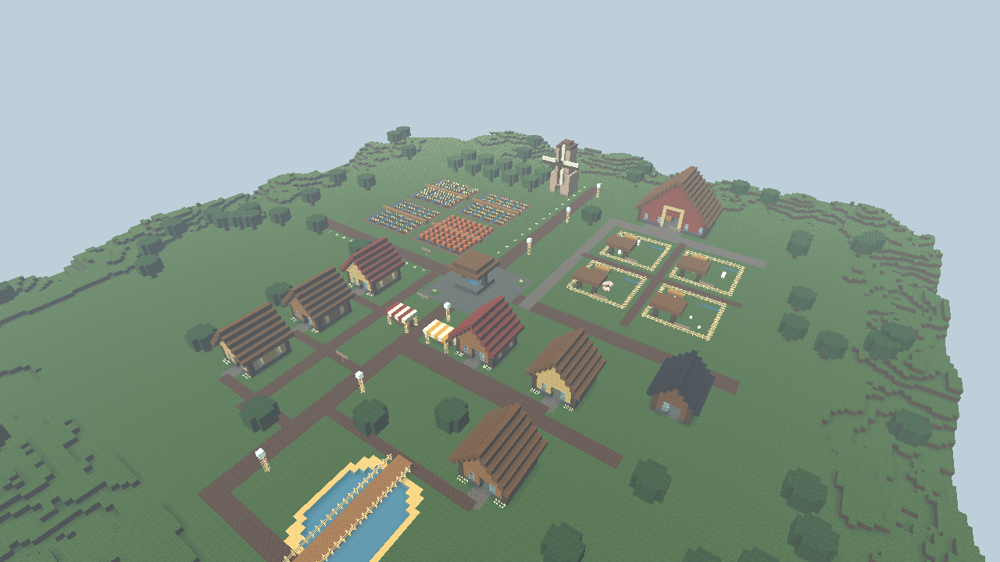
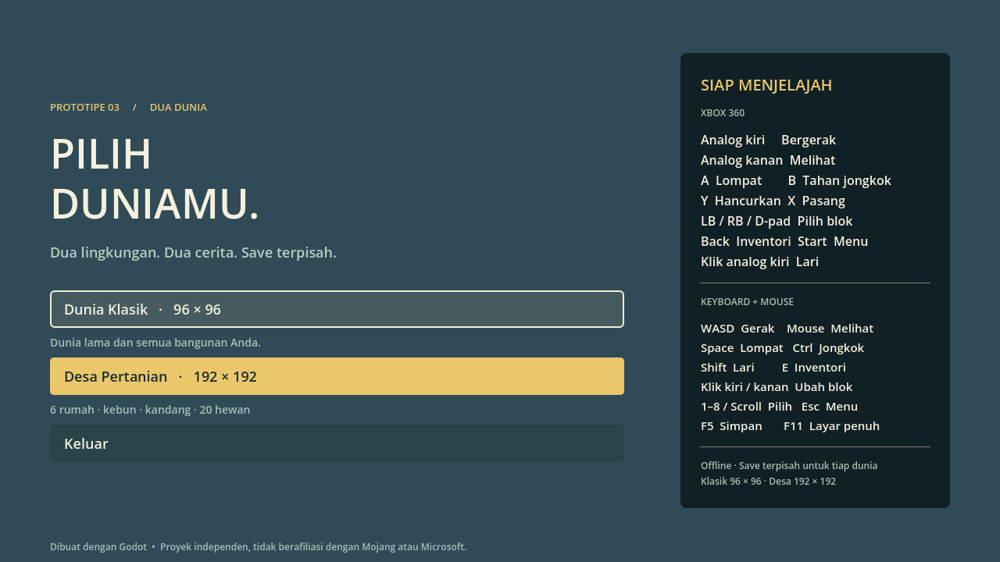

# Dunia Minecraft

Prototipe game voxel 3D **single-player offline** untuk Windows 10/11, dengan kontrol utama **Xbox 360** dan dukungan keyboard/mouse. Dibuat menggunakan Godot 4.6.1 dan renderer Compatibility.



## Mainkan

1. Unduh `DuniaMinecraft-Windows-x64.zip` dari [Releases](https://github.com/Muhira007/Dunia-Minecraft/releases).
2. Ekstrak ZIP, lalu buka `DuniaMinecraft.exe`. Tidak perlu memasang Godot atau menjalankan server.
3. Pilih **Dunia Klasik** atau **Desa Pertanian** dengan mouse atau D-pad dan tombol **A** pada controller.

## Jalankan langsung dari repo (Windows)

Clone atau unduh dan ekstrak repository ini, lalu klik dua kali:

- **`Mainkan.bat`**: menjalankan game langsung dari source di folder repo. Setelah kode diperbaiki, tutup game dan klik lagi untuk mencoba perubahan terbaru, tanpa build/export ulang.
- **`Debug.bat`**: menjalankan source yang sama dengan konsol error langsung. Setelah game ditutup, konsol tetap terbuka sampai Anda menekan Enter.

Jika Godot belum tersedia, launcher otomatis mengunduh editor portabel resmi (~80 MB, sekali saja), memverifikasi SHA-512, dan menaruhnya di `.tools/`. Tidak memerlukan instalasi sistem maupun export templates. Setelah itu bisa berjalan offline. Di komputer ini Godot sudah tersedia.

Log setiap sesi disimpan terpisah di **`artifacts/logs/game-<tanggal-jam>.log`**; log persiapan aset memakai awalan `import-`. Jika menemukan bug, sertakan log sesi terkait dan langkah untuk mengulang masalahnya. Folder log tidak di-push ke GitHub.

`Mainkan.cmd` juga mengarah ke launcher source yang sama. Untuk memainkan hasil export tertentu, buka `build/DuniaMinecraft.exe` secara langsung. Launcher menjalankan source lokal saat ini; untuk mengambil perbaikan dari GitHub, lakukan `git pull` terlebih dahulu.

## Baru di versi 0.3.0: pilih dunia & Desa Pertanian

Launcher **Mainkan.bat tetap sama**. Tutup game lama, jalankan kembali, lalu pilih lingkungan di menu awal. Untuk berpindah saat bermain: **Start/Esc → Simpan & pilih dunia**. Perpindahan dibatalkan jika save gagal.

| Dunia | Ukuran | Isi |
| --- | --- | --- |
| Dunia Klasik | 96 × 96 × 40 | Dunia lama, generator dan ID blok lama tetap sama. |
| Desa Pertanian | 192 × 192 × 40 | Empat kali luas klasik, bukan empat kali panjang setiap sisinya. |

Desa Pertanian berisi enam rumah yang bisa dimasuki, sumur, dua kios hasil panen, lumbung jerami, gudang kecil, kincir dekoratif, empat petak tanaman beririgasi, kebun apel, empat kandang, jalan pedesaan, kolam dangkal, jembatan, bunga, dan pepohonan. Padang di barat/selatan desa disisakan untuk membangun. Lihat [panduan desa dan batas mekanik](docs/DESA-PERTANIAN.md).

Ada **20 hewan**: 5 sapi, 5 domba, 4 babi, dan 6 ayam. Mereka berjalan, beristirahat, menggerakkan kaki, menghindari halangan, dan tetap berada dalam wilayah kandang. Posisi/arah hewan tersimpan. Aktivitas dihentikan saat menu dibuka atau pemain jauh; hewan juga memiliki collision.




Dunia desa memakai pemuatan chunk bertahap di dekat pemain, bukan menampilkan seluruh dunia terus-menerus. Batas area dapat terlihat dari tempat tinggi dan perpindahan area dapat menyebabkan jeda singkat saat mesh dibuat. Foto tinjauan udara di atas memuat seluruh dunia khusus untuk pemeriksaan visual, bukan beban rendering permainan normal.

## Fitur permainan

- Dunia berbukit 96 × 96 blok, tinggi maksimum 40 blok, dengan pohon dan area berpasir.
- Kamera orang pertama; berjalan, berlari, melompat, dan jongkok.
- Menghancurkan dan memasang blok hingga jarak 6 blok, dengan penanda sasaran.
- **187 bahan kreatif**: 177 bahan sebelumnya ditambah tanah ladang, air dekoratif, bal jerami, labu, daun apel, gandum, wortel, kentang, pagar, dan bunga. Lihat [katalog lengkap](docs/CATALOG.md).
- Tekstur orisinal **32 × 32 piksel** (sebelumnya 16 × 16): serat/end-grain kayu, sambungan bata, batu pahat, anyaman wol, serta variasi permukaan tiap bahan.
- Bayangan sudut antarblok (ambient occlusion), mipmap dan filter anisotropik; ikon inventori dan blok di tangan memakai tekstur sebenarnya.
- Kaca transparan yang tetap bisa ditabrak/ditargetkan; glowstone, lentera laut, dan shroomlight memancarkan cahaya lokal.
- Inventori berkategori dan berpencarian, 18 bahan per halaman, serta delapan slot hotbar yang bisa diisi ulang dan tersimpan.
- Inventori, menu jeda, pengaturan sensitivitas kamera, kembali ke titik awal, dan layar penuh.
- Save otomatis setiap 30 detik bermain, saat kehilangan fokus, dan saat keluar secara normal.
- Cadangan save sebelumnya, pemulihan jika save utama rusak, dan pesan jika penyimpanan gagal.
- Suara interaksi, getaran controller jika didukung, serta jeda otomatis ketika controller terlepas.
- Tekstur piksel dan suara dibuat lewat kode, tanpa aset Minecraft.

Ini masih prototipe kreatif: belum ada survival, crafting, musuh, multiplayer, pembuatan slot dunia bebas, atau dunia tak terbatas. Pilihan dunia saat ini dua lingkungan tetap. Tidak membutuhkan server maupun koneksi internet untuk bermain.


Adegan di atas adalah galeri pengujian material, bukan bangunan tambahan di save pemain. Sebagian besar bahan berupa kubus penuh; tanaman dan pagar memakai bentuk khusus. Belum ada slab, tangga khusus, pintu interaktif, simulasi aliran air, atau mekanik redstone. Varian tembaga dipilih manual. Cahaya lokal dibatasi delapan lampu terdekat tanpa bayangan dinamis lampu.

### Mengganti isi hotbar

Pilih slot dengan LB/RB atau 1–8, buka inventori dengan **Back / E**, lalu pilih bahan dengan **A / klik**. Bahan itu menggantikan isi slot aktif dan Anda kembali bermain. **Y tetap menghancurkan; X tetap memasang.**

Di inventori: D-pad/analog kiri atau panah untuk navigasi, **LB/RB** atau **PgUp/PgDn** untuk halaman, **LT/RT** untuk kategori, dan **B/Back/E/Esc** untuk kembali. Klik kolom pencarian untuk mengetik nama Indonesia atau Inggris; mengetik huruf E di kolom ini tidak menutup inventori.


## Kontrol

| Aksi | Xbox 360 | Keyboard / mouse |
| --- | --- | --- |
| Bergerak | Analog kiri | WASD |
| Melihat | Analog kanan | Mouse |
| Lompat | A | Space |
| Jongkok (tahan) | B | Ctrl |
| Lari (tahan) | Klik analog kiri | Shift |
| Hancurkan blok | Y | Klik kiri |
| Pasang blok | X | Klik kanan |
| Pilih blok | LB/RB atau D-pad | 1–8 atau scroll |
| Inventori | Back | E |
| Menu jeda | Start | Esc |
| Simpan | — | F5 |
| Navigasi menu | D-pad / analog kiri; A pilih; B kembali | Panah / Tab / Enter / mouse |
| Layar penuh | — | F11 |

Sensitivitas kamera dapat diubah melalui menu jeda. Analog memakai deadzone agar drift kecil tidak menggerakkan kamera. Tombol B menurunkan badan saat bermain dan kembali saat berada di menu.

Controller harus dikenali Windows. Untuk Xbox 360 wireless diperlukan receiver yang sesuai. Validasi pemetaan dan navigasi menu memakai input sintetis; rasa analog, trigger, getaran, dan koneksi perangkat fisik perlu dicoba pada controller pengguna.

## Penyimpanan

Folder save: `%APPDATA%\DuniaMinecraft\`.

- Dunia Klasik: `world.json` (lokasi lama tidak dipindah).
- Desa Pertanian: `worlds\desa-pertanian.json`.
- Cadangan terakhir masing-masing: nama file dengan akhiran `.bak`.
- Sebelum membuka save klasik lama untuk pertama kali, game membuat salinan satu kali **`world.json.pre-v0.3.bak`**, tanpa menimpa salinan tersebut pada sesi berikutnya. Kegagalan membuat backup membatalkan pemuatan.

Save v0.1/v0.2 tetap terbaca di slot Klasik. Semua ID bahan lama dan generator klasik dipertahankan. Save baru berformat versi 3, menyimpan identitas/ukuran dunia, seed, perubahan blok, posisi, arah kamera, hotbar, dan posisi hewan. Versi EXE lama tidak memahami format ini; gunakan salinan backup jika hendak kembali ke versi lama. Sensitivitas kamera berlaku selama sesi berjalan.

Jika save utama rusak, game mencoba cadangan dunia yang sama. File rusak diarsipkan dengan akhiran `.corrupt-...` sebelum diganti. Jika keduanya tidak valid atau identitas dunia tidak cocok, pemuatan dibatalkan dengan pesan; dunia tersebut tidak direset otomatis. Uji otomatis menggunakan folder sementara terpisah dan tidak membaca/menulis save permainan Anda.

## Pengembangan dan build Windows

Buka `project.godot` dengan **Godot 4.6.1 Standard**. Tidak memerlukan .NET maupun plugin tambahan. Untuk bootstrap, test, export, dan paket ZIP dari PowerShell:

```powershell
powershell -ExecutionPolicy Bypass -File .\tools\build.ps1
```

Script mengunduh Godot portabel (~80 MB) dan export templates resmi (~1,25 GB, hanya pertama kali), memverifikasi SHA-512, menjalankan tes, lalu menghasilkan `build/DuniaMinecraft.exe` dengan PCK tertanam dan ZIP distribusi. Alat tersimpan di `.tools/`; tidak ada instalasi sistem. Setelah alat tersedia, tambahkan `-SkipSetup` untuk membangun tanpa unduhan.

Pengujian langsung:

```powershell
& .\.tools\godot\Godot_v4.6.1-stable_win64_console.exe --headless --path . --script tests/test_core.gd
& .\.tools\godot\Godot_v4.6.1-stable_win64_console.exe --headless --path . --script tests/test_worlds.gd
& .\.tools\godot\Godot_v4.6.1-stable_win64_console.exe --headless --path . -- --smoke-test
& .\.tools\godot\Godot_v4.6.1-stable_win64_console.exe --path . -- --capture
& .\.tools\godot\Godot_v4.6.1-stable_win64_console.exe --path . -- --capture-farm
```

Tes inti memeriksa 450 kondisi; tes dunia memeriksa 95 kondisi tambahan, termasuk luas 4×, layout deterministik, pintu masuk rumah, bentuk tanaman/pagar, collision air, streaming, hewan, backup lama yang identik byte demi byte, serta isolasi save v1/v2/v3. Smoke test menjalankan gerak pemain, kontrol Xbox sintetis, pergantian dunia, gerak dan jeda hewan, perlindungan dari penempatan blok, pemulihan hotbar/posisi, serta pembatalan pergantian dunia ketika save gagal. Smoke test yang sama dijalankan pada EXE hasil export.

`--capture` menghasilkan empat PNG klasik/material. `--capture-farm` menghasilkan lima PNG pilihan dunia/desa/ternak/ladang di `artifacts/`. Semua mode otomatis memakai data uji terpisah tanpa membaca/menulis save pemain.

Uji tampilan awal klasik dan Desa Pertanian pada Intel UHD Graphics 620, 1280 × 720: sekitar 59–60 FPS setelah pemuatan. Ini pengukuran adegan awal, bukan jaminan performa saat berjalan melintasi chunk atau di semua perangkat/dunia yang telah banyak diubah. Diperlukan Windows 64-bit dan driver yang mendukung OpenGL 3.3.

## Struktur

- `scripts/voxel_world.gd`: generator deterministik, data voxel, raycast grid, mesh permukaan terbuka, dan collision per chunk 16 × 16.
- `scripts/player.gd`: gerak orang pertama, analog, gravitasi, lompat, dan jongkok.
- `scripts/main.gd`: alur permainan, antarmuka, interaksi, audio, dan integrasi save.
- `scripts/blocks.gd`, `block_textures.gd`: registry dengan ID permanen, atlas 32px, material, dan ikon.
- `scripts/inventory.gd`, `hud.gd`: perpustakaan bahan, pencarian, paging, dan hotbar.
- `scripts/game_input.gd`, `save_store.gd`: pemetaan input dan penyimpanan kompatibel v1/v2.
- `scripts/material_showcase.gd`: galeri visual deterministik, hanya untuk mode `--capture`.
- `scripts/farm_layout.gd`: generator Desa Pertanian dengan layout tetap, bangunan, kebun, dan kandang.
- `scripts/farm_animal.gd`, `farm_herd.gd`: model hewan, AI terbatas kandang, pembatasan jarak, dan snapshot save.
- `scripts/box_geometry.gd`, `voxel_shapes.gd`: geometri orisinal hewan, tanaman, dan pagar; tanaman dirender dalam batch per chunk.
- `tests/test_worlds.gd`, `scripts/farm_verification.gd`: tes migrasi/save dunia, integrasi desa, dan tangkapan layar.
- `tests/test_core.gd`, `tools/build.ps1`: validasi dan build yang dapat diulang.
- `Mainkan.bat`, `Debug.bat`, `tools/run.ps1`: launcher source, bootstrap editor, dan log per sesi.

Godot menggunakan lisensi MIT; lihat `LICENSE-Godot.txt` dan `THIRD-PARTY-Godot.txt`. Referensi: [dokumentasi controller](https://docs.godotengine.org/en/stable/tutorials/inputs/controllers_gamepads_joysticks.html), [export Windows](https://docs.godotengine.org/en/4.6/tutorials/export/exporting_for_windows.html), [material, transparansi, sRGB, dan emission](https://docs.godotengine.org/en/4.6/classes/class_basematerial3d.html).

Proyek independen; tidak berafiliasi dengan atau didukung Mojang/Microsoft. Minecraft adalah merek pemiliknya masing-masing.
