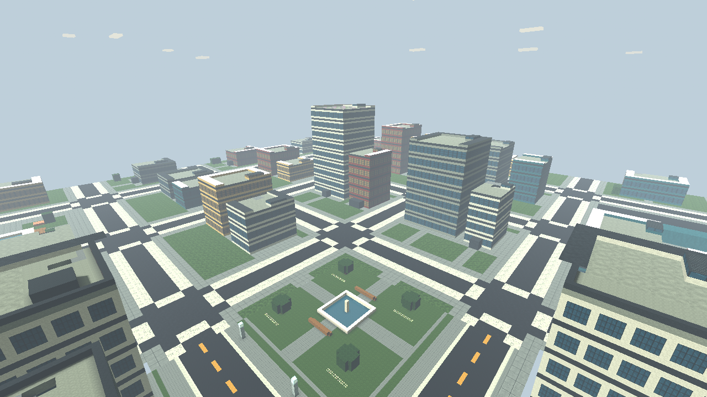
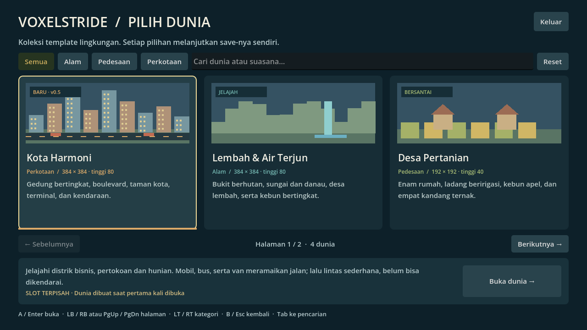
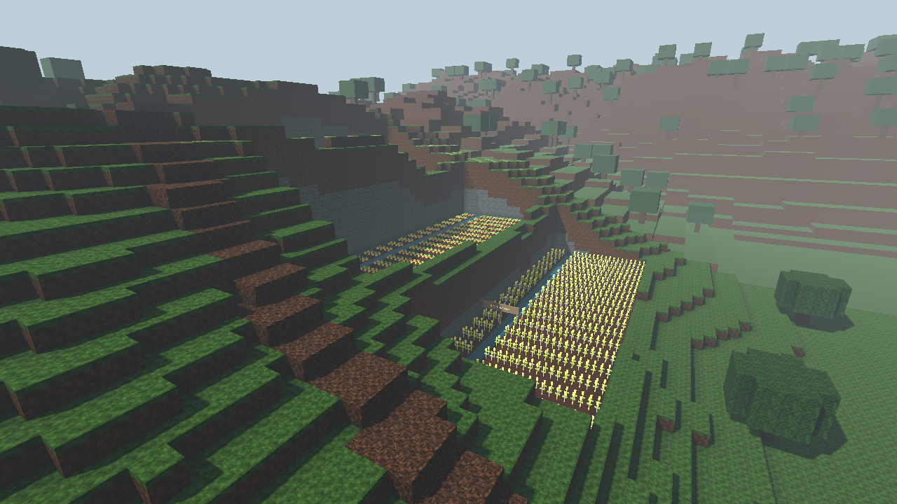
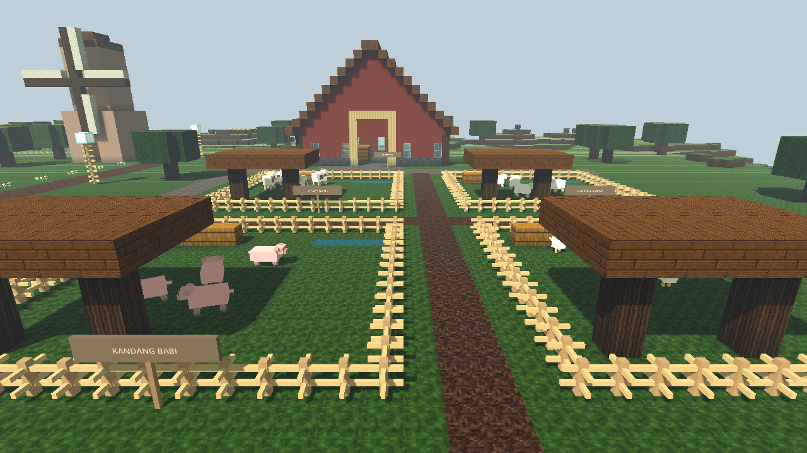
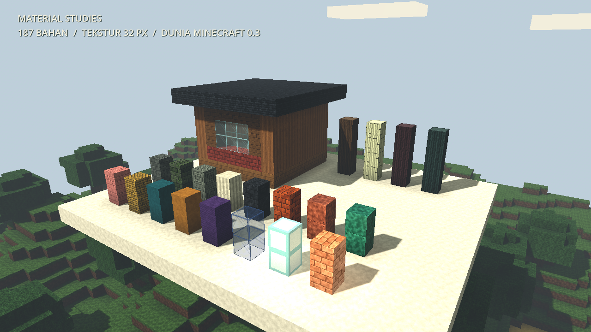
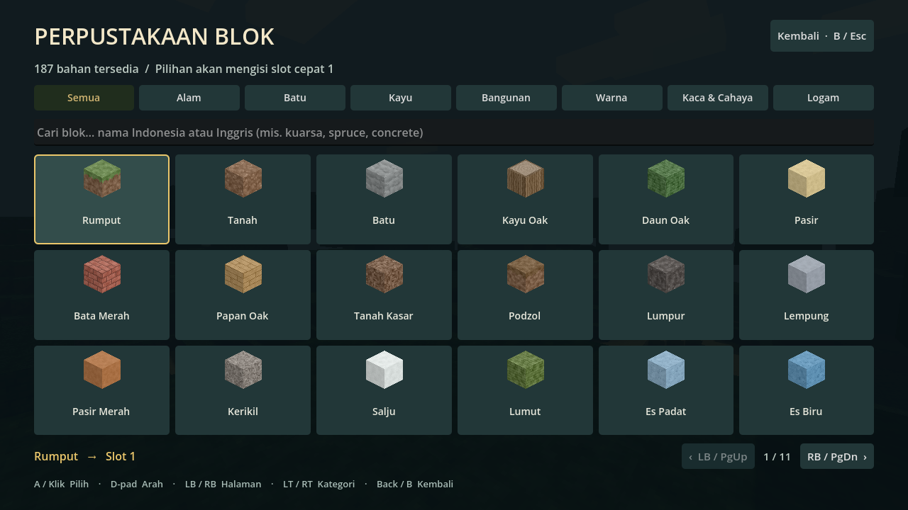

# voxelstride

Prototipe game voxel 3D **single-player offline** untuk Windows 10/11, dengan kontrol utama **Xbox 360** dan dukungan keyboard/mouse. Dibuat menggunakan Godot 4.6.1 dan renderer Compatibility.



## Mainkan

1. Unduh `voxelstride-Windows-x64.zip` dari [Releases](https://github.com/Muhira007/voxelstride/releases).
2. Ekstrak ZIP, lalu buka `voxelstride.exe`. Tidak perlu memasang Godot atau menjalankan server.
3. Pilih kartu dunia di katalog, lalu klik **Buka dunia** atau tekan **A / Enter**. **Kota Harmoni** tersedia di halaman pertama; navigasi halaman dengan **LB/RB** atau **PgUp/PgDn**.

## Jalankan langsung dari repo (Windows)

Clone atau unduh dan ekstrak repository ini, lalu klik dua kali:

- **`Mainkan.bat`**: menjalankan game langsung dari source di folder repo. Setelah kode diperbaiki, tutup game dan klik lagi untuk mencoba perubahan terbaru, tanpa build/export ulang.
- **`Debug.bat`**: menjalankan source yang sama dengan konsol error langsung. Setelah game ditutup, konsol tetap terbuka sampai Anda menekan Enter.

Jika Godot belum tersedia, launcher otomatis mengunduh editor portabel resmi (~80 MB, sekali saja), memverifikasi SHA-512, dan menaruhnya di `.tools/`. Tidak memerlukan instalasi sistem maupun export templates. Setelah itu bisa berjalan offline. Di komputer ini Godot sudah tersedia.

Log setiap sesi disimpan terpisah di **`artifacts/logs/game-<tanggal-jam>.log`**; log persiapan aset memakai awalan `import-`. Jika menemukan bug, sertakan log sesi terkait dan langkah untuk mengulang masalahnya. Folder log tidak di-push ke GitHub.

`Mainkan.cmd` juga mengarah ke launcher source yang sama. Untuk memainkan hasil export tertentu, buka `build/voxelstride.exe` secara langsung. Launcher menjalankan source lokal saat ini; untuk mengambil perbaikan dari GitHub, lakukan `git pull` terlebih dahulu.

## Baru di versi 0.5.0: Kota Harmoni & katalog template

Launcher **Mainkan.bat tetap sama**. Tutup game lama, jalankan kembali, lalu pilih lingkungan di menu awal. Untuk berpindah saat bermain: **Start/Esc → Simpan & pilih dunia**. Perpindahan dibatalkan jika save gagal.

**Kota Harmoni** adalah dunia perkotaan 384 × 384: 40 gedung dengan pintu terbuka dan tangga sampai atap, boulevard bermarka, trotoar/zebra cross, taman kota, terminal, kawasan pertokoan, hunian, dan depot. Ada **22 kendaraan** (12 mobil, 5 bus, 5 van): sepuluh bergerak pada rute tetap dan dua belas parkir. Kendaraan mengalah pada pemain/penghalang, memiliki collision, berhenti saat menu dibuka, dan menyimpan kemajuan rutenya. **Belum dapat dikendarai**. Lihat [panduan kota](docs/KOTA-HARMONI.md).

Halaman pilihan dunia kini berupa **katalog tiga kartu per halaman**, lengkap dengan kategori, pencarian, keterangan, status save dan tombol navigasi. Jumlah halaman mengikuti jumlah template. **LT/RT** mengganti kategori; **LB/RB** atau PgUp/PgDn mengganti halaman. Pencarian/navigasi tidak mengubah save. Memilih template lagi melanjutkan slot yang sama, bukan membuat slot kosong baru. Lihat [panduan katalog dan penambahan template](docs/TEMPLATE-DUNIA.md).



| Dunia | Ukuran | Isi |
| --- | --- | --- |
| Dunia Klasik | 96 × 96 × 40 | Dunia lama, generator dan ID blok lama tetap sama. |
| Desa Pertanian | 192 × 192 × 40 | Empat kali luas klasik, bukan empat kali panjang setiap sisinya. |
| Lembah & Air Terjun | 384 × 384 × 80 | Empat kali luas desa, 16 kali luas klasik; bukit, air terjun, sungai, dan danau. |
| Kota Harmoni | 384 × 384 × 80 | Gedung, boulevard, taman, terminal, dan kendaraan; save terpisah. |

### Lembah & Air Terjun tetap tersedia

Dunia ketiga membawa desa beserta 20 ternaknya ke dalam lembah yang jauh lebih luas. Ada **air terjun setinggi 35 blok** dengan animasi, percikan sederhana dan suara lokal, sungai berkelok yang tersambung ke danau, tiga kebun bertingkat, hutan, pondok, menara pandang dengan tangga blok, dua jembatan sungai, jalur ke puncak, dan padang terbuka. Baca [panduan lokasi dan batas mekanik](docs/LEMBAH-AIR-TERJUN.md).

Pemandangan jauh memakai geometri sederhana; blok bertekstur lengkap dan collision dimuat di dekat pemain. Bukit tetap terlihat di luar area detail. Peralihan detail dapat terlihat dan pembuatan chunk masih dapat menyebabkan jeda. Dua dunia sebelumnya dan generatornya **tidak diperbesar atau ditimpa**; pilih slot baru untuk menikmati perluasan.



### Desa Pertanian tetap tersedia

Desa Pertanian berisi enam rumah yang bisa dimasuki, sumur, dua kios hasil panen, lumbung jerami, gudang kecil, kincir dekoratif, empat petak tanaman beririgasi, kebun apel, empat kandang, jalan pedesaan, kolam dangkal, jembatan, bunga, dan pepohonan. Padang di barat/selatan desa disisakan untuk membangun. Lihat [panduan desa dan batas mekanik](docs/DESA-PERTANIAN.md).

Ada **20 hewan**: 5 sapi, 5 domba, 4 babi, dan 6 ayam. Mereka berjalan, beristirahat, menggerakkan kaki, menghindari halangan, dan tetap berada dalam wilayah kandang. Posisi/arah hewan tersimpan. Aktivitas dihentikan saat menu dibuka atau pemain jauh; hewan juga memiliki collision.



Dunia desa memakai pemuatan chunk bertahap di dekat pemain. Batas area dapat terlihat dari tempat tinggi. [Foto tinjauan udara desa](docs/farm-overview.png) memuat seluruh dunia khusus untuk pemeriksaan visual, bukan beban rendering permainan normal. Sistem pemandangan jauh digunakan di Lembah & Air Terjun dan Kota Harmoni; kota memakai pola fasad sederhana agar skyline tetap terbaca.

## Fitur permainan

- Empat lingkungan tetap, dari klasik 96 × 96 hingga lembah dan kota 384 × 384 dengan tinggi maksimum 80 blok.
- Kamera orang pertama; berjalan, berlari, melompat, dan jongkok.
- Menghancurkan dan memasang blok hingga jarak 6 blok, dengan penanda sasaran.
- **194 bahan kreatif**: seluruh 187 bahan sebelumnya ditambah aspal, paving trotoar, marka putih/kuning, panel jendela biru/hangat, dan ventilasi atap. Tekstur kota 32px dibuat melalui kode; ID bahan lama tetap sama. Lihat [katalog lengkap](docs/CATALOG.md).
- Tekstur orisinal **32 × 32 piksel** (sebelumnya 16 × 16): serat/end-grain kayu, sambungan bata, batu pahat, anyaman wol, serta variasi permukaan tiap bahan.
- Bayangan sudut antarblok (ambient occlusion), mipmap dan filter anisotropik; ikon inventori dan blok di tangan memakai tekstur sebenarnya.
- Kaca transparan yang tetap bisa ditabrak/ditargetkan; glowstone, lentera laut, dan shroomlight memancarkan cahaya lokal.
- Inventori berkategori dan berpencarian, 18 bahan per halaman, serta delapan slot hotbar yang bisa diisi ulang dan tersimpan.
- Inventori, menu jeda, pengaturan sensitivitas kamera, kembali ke titik awal, dan layar penuh.
- Save otomatis setiap 30 detik bermain, saat kehilangan fokus, dan saat keluar secara normal.
- Cadangan save sebelumnya, pemulihan jika save utama rusak, dan pesan jika penyimpanan gagal.
- Suara interaksi, getaran controller jika didukung, serta jeda otomatis ketika controller terlepas.
- Tekstur piksel dan suara dibuat lewat kode, tanpa aset Minecraft.

Ini masih prototipe kreatif: belum ada survival, crafting, musuh, multiplayer, pembuatan slot dunia bebas, atau dunia tak terbatas. Pilihan dunia saat ini empat lingkungan tetap. Kendaraan adalah objek lalu lintas/parkir, belum bisa dikendarai. Tidak membutuhkan server maupun koneksi internet untuk bermain.



Adegan di atas adalah galeri pengujian material, bukan bangunan tambahan di save pemain. Sebagian besar bahan berupa kubus penuh; tanaman dan pagar memakai bentuk khusus. Belum ada slab, tangga khusus, pintu interaktif, simulasi aliran air, atau mekanik redstone. Varian tembaga dipilih manual. Cahaya lokal dibatasi delapan lampu terdekat tanpa bayangan dinamis lampu.

### Mengganti isi hotbar

Pilih slot dengan LB/RB atau 1–8, buka inventori dengan **Back / E**, lalu pilih bahan dengan **A / klik**. Bahan itu menggantikan isi slot aktif dan Anda kembali bermain. **Y tetap menghancurkan; X tetap memasang.**

Di inventori: D-pad/analog kiri atau panah untuk navigasi, **LB/RB** atau **PgUp/PgDn** untuk halaman, **LT/RT** untuk kategori, dan **B/Back/E/Esc** untuk kembali. Klik kolom pencarian untuk mengetik nama Indonesia atau Inggris; mengetik huruf E di kolom ini tidak menutup inventori.



## Kontrol

| Aksi | Xbox 360 | Keyboard / mouse |
| --- | --- | --- |
| Bergerak | Analog kiri | WASD |
| Melihat | Analog kanan | Mouse |
| Lompat | A | Space |
| Jongkok (tahan) | B | Ctrl |
| Lari (tahan) | Klik analog kiri | Shift |
| Hancurkan blok | Y | Klik kiri |
| Pasang blok | X | Klik kanan |
| Pilih blok | LB/RB atau D-pad | 1–8 atau scroll |
| Inventori | Back | E |
| Menu jeda | Start | Esc |
| Simpan | — | F5 |
| Navigasi menu | D-pad / analog kiri; A pilih; B kembali | Panah / Tab / Enter / mouse |
| Layar penuh | — | F11 |

Sensitivitas kamera dapat diubah melalui menu jeda. Analog memakai deadzone agar drift kecil tidak menggerakkan kamera. Tombol B menurunkan badan saat bermain dan kembali saat berada di menu.

Controller harus dikenali Windows. Untuk Xbox 360 wireless diperlukan receiver yang sesuai. Validasi pemetaan dan navigasi menu memakai input sintetis; rasa analog, trigger, getaran, dan koneksi perangkat fisik perlu dicoba pada controller pengguna.

## Penyimpanan

Folder save: `%APPDATA%\voxelstride\`.

- Dunia Klasik: `world.json`.
- Desa Pertanian: `worlds\desa-pertanian.json`.
- Lembah & Air Terjun: `worlds\lembah-air-terjun.json`.
- Kota Harmoni: `worlds\kota-harmoni.json`.
- Cadangan terakhir masing-masing: nama file dengan akhiran `.bak`.
- Sebelum membuka save klasik lama untuk pertama kali, game membuat salinan satu kali **`world.json.pre-v0.3.bak`**, tanpa menimpa salinan tersebut pada sesi berikutnya. Kegagalan membuat backup membatalkan pemuatan.

Save v0.1/v0.2 tetap terbaca di slot Klasik; save kedua dunia dari v0.3 juga tetap terbaca. Semua ID bahan lama serta generator klasik/desa dipertahankan. Format save tetap versi 3, menyimpan identitas/ukuran dunia, seed, perubahan blok, posisi, arah kamera, hotbar, dan posisi hewan; dunia lembah memerlukan metadata tinggi 80 dan generator 3. EXE v0.3 tidak mengenali slot lembah; EXE v0.1/v0.2 tidak memahami format save versi 3. Gunakan backup jika hendak kembali ke versi lama. Sensitivitas kamera berlaku selama sesi berjalan.

Kota memakai generator 4, tinggi 80, dan field `vehicles` untuk sepuluh kendaraan bergerak. Save lembah v0.4 tetap kompatibel; EXE v0.4 dan lebih lama tidak mengenali kota atau tujuh bahan baru. Lokasi save proyek tetap memakai nama `voxelstride`; pembaruan ini tidak memindahkan atau menimpa folder save lain.

Jika save utama rusak, game mencoba cadangan dunia yang sama. File rusak diarsipkan dengan akhiran `.corrupt-...` sebelum diganti. Jika keduanya tidak valid atau identitas dunia tidak cocok, pemuatan dibatalkan dengan pesan; dunia tersebut tidak direset otomatis. Uji otomatis menggunakan folder sementara terpisah dan tidak membaca/menulis save permainan Anda.

## Pengembangan dan build Windows

Buka `project.godot` dengan **Godot 4.6.1 Standard**. Tidak memerlukan .NET maupun plugin tambahan. Untuk bootstrap, test, export, dan paket ZIP dari PowerShell:

```powershell
powershell -ExecutionPolicy Bypass -File .\tools\build.ps1
```

Script mengunduh Godot portabel (~80 MB) dan export templates resmi (~1,25 GB, hanya pertama kali), memverifikasi SHA-512, menjalankan tes, lalu menghasilkan `build/voxelstride.exe` dengan PCK tertanam dan ZIP distribusi. Alat tersimpan di `.tools/`; tidak ada instalasi sistem. Setelah alat tersedia, tambahkan `-SkipSetup` untuk membangun tanpa unduhan.

Pengujian langsung:

```powershell
& .\.tools\godot\Godot_v4.6.1-stable_win64_console.exe --headless --path . --script tests/test_core.gd
& .\.tools\godot\Godot_v4.6.1-stable_win64_console.exe --headless --path . --script tests/test_worlds.gd
& .\.tools\godot\Godot_v4.6.1-stable_win64_console.exe --headless --path . --script tests/test_valley.gd
& .\.tools\godot\Godot_v4.6.1-stable_win64_console.exe --headless --path . --script tests/test_city.gd
& .\.tools\godot\Godot_v4.6.1-stable_win64_console.exe --headless --path . -- --smoke-test
& .\.tools\godot\Godot_v4.6.1-stable_win64_console.exe --path . -- --capture
& .\.tools\godot\Godot_v4.6.1-stable_win64_console.exe --path . -- --capture-farm
& .\.tools\godot\Godot_v4.6.1-stable_win64_console.exe --path . -- --capture-valley
& .\.tools\godot\Godot_v4.6.1-stable_win64_console.exe --path . -- --capture-city
```

Tes inti memeriksa 464 kondisi, tes dunia 95, tes lembah 74, serta tes kota/katalog 532: **1.165 pemeriksaan**. Cakupannya meliputi determinisme, ID bahan stabil, pintu dan tangga gedung, sambungan jalan/air, pembaruan tampilan jauh setelah edit, dukungan seluruh rute bus, kendaraan mengalah pada pemain/edit jalan, pencarian/paginasi katalog sampai 17 template sintetis, serta backup dan isolasi save. Smoke test menguji controller sintetis, pergantian empat dunia, hewan, air terjun, lalu lintas nyata, collision bus dan atap, pause, pemulihan save kendaraan, serta pesan kegagalan save pada katalog. Smoke test yang sama dijalankan pada EXE hasil export.

`--capture` menghasilkan empat PNG klasik/material. `--capture-farm` menghasilkan lima PNG pilihan dunia/desa/ternak/ladang. `--capture-valley` menghasilkan tujuh PNG pilihan dunia, gameplay, air terjun, tinjauan LOD, teras, danau dan menara di `artifacts/`, serta pengukuran frame pada dua adegan setelah pemuatan. Semua mode otomatis memakai data uji terpisah tanpa membaca/menulis save pemain. Waktu pemuatan setiap dunia dicatat di log.

`--capture-city` menghasilkan tujuh PNG: dua halaman katalog, jalan kota, tinjauan kota, lalu lintas, terminal, dan lobby. Ilustrasi pada kartu katalog adalah gambar tematik dari kode, bukan screenshot kondisi save pemain.

Uji tampilan awal klasik dan Desa Pertanian pada Intel UHD Graphics 620, 1280 × 720: sekitar 59–60 FPS setelah pemuatan. Ini pengukuran adegan awal, bukan jaminan performa saat berjalan melintasi chunk atau di semua perangkat/dunia yang telah banyak diubah. Diperlukan Windows 64-bit dan driver yang mendukung OpenGL 3.3.

Pada perangkat/resolusi yang sama, sampel lembah setelah pemuatan menunjukkan **60 FPS**: median frame 16,6 ms di desa dan 16,5 ms di air terjun; p95 masing-masing 20,1 ms dan 20,2 ms (180 frame per adegan). Pemuatan lembah pada satu sesi ini sekitar 17,8 detik. Ini pengukuran kamera diam, bukan benchmark penjelajahan atau jaminan bebas stutter.

Sampel Kota Harmoni di perangkat/resolusi sama: **60 FPS**, median 16,7 ms (taman) / 16,8 ms (boulevard), p95 18,6 / 18,8 ms. Pemuatan pada sesi tersebut 14,1 detik. Pengukuran 180 frame per adegan setelah pemuatan dengan lalu lintas aktif; tidak menjamin performa saat berpindah chunk atau setelah dunia banyak diedit.

## Struktur

- `scripts/voxel_world.gd`: generator deterministik, data voxel, raycast grid, mesh permukaan terbuka, dan collision per chunk 16 × 16.
- `scripts/player.gd`: gerak orang pertama, analog, gravitasi, lompat, dan jongkok.
- `scripts/main.gd`: alur permainan, antarmuka, interaksi, audio, dan integrasi save.
- `scripts/blocks.gd`, `block_textures.gd`: registry dengan ID permanen, atlas 32px, material, dan ikon.
- `scripts/inventory.gd`, `hud.gd`: perpustakaan bahan, pencarian, paging, dan hotbar.
- `scripts/game_input.gd`, `save_store.gd`: pemetaan input dan penyimpanan kompatibel v1/v2.
- `scripts/material_showcase.gd`: galeri visual deterministik, hanya untuk mode `--capture`.
- `scripts/farm_layout.gd`: generator Desa Pertanian dengan layout tetap, bangunan, kebun, dan kandang.
- `scripts/valley_layout.gd`, `far_landscape.gd`, `waterfall.gd`: dunia lembah 384 × 384, pemandangan jauh per chunk dan efek air terjun lokal.
- `scripts/city_layout.gd`, `city_vehicle.gd`, `city_traffic.gd`: kota, gedung bertangga, model kendaraan, collision dan rute tersimpan.
- `scripts/world_catalog.gd`, `world_picker.gd`, `world_card.gd`: metadata template/save, katalog berpaginasi dan ilustrasi kartu.
- `scripts/farm_animal.gd`, `farm_herd.gd`: model hewan, AI terbatas kandang, pembatasan jarak, dan snapshot save.
- `scripts/box_geometry.gd`, `voxel_shapes.gd`: geometri orisinal hewan, tanaman, dan pagar; tanaman dirender dalam batch per chunk.
- `tests/test_worlds.gd`, `scripts/farm_verification.gd`: tes migrasi/save dunia, integrasi desa, dan tangkapan layar.
- `tests/test_valley.gd`, `scripts/valley_verification.gd`: tes medan/jalur/air, save tinggi, pergantian tiga dunia, dan QA visual lembah.
- `tests/test_city.gd`, `scripts/city_verification.gd`: tes kota, kendaraan, katalog yang dapat diperluas, integrasi dan QA visual.
- `tests/test_core.gd`, `tools/build.ps1`: validasi dan build yang dapat diulang.
- `Mainkan.bat`, `Debug.bat`, `tools/run.ps1`: launcher source, bootstrap editor, dan log per sesi.

Godot menggunakan lisensi MIT; lihat `LICENSE-Godot.txt` dan `THIRD-PARTY-Godot.txt`. Referensi: [dokumentasi controller](https://docs.godotengine.org/en/stable/tutorials/inputs/controllers_gamepads_joysticks.html), [export Windows](https://docs.godotengine.org/en/4.6/tutorials/export/exporting_for_windows.html), [material, transparansi, sRGB, dan emission](https://docs.godotengine.org/en/4.6/classes/class_basematerial3d.html).

Proyek independen; tidak berafiliasi dengan atau didukung Mojang/Microsoft. Minecraft adalah merek pemiliknya masing-masing.
