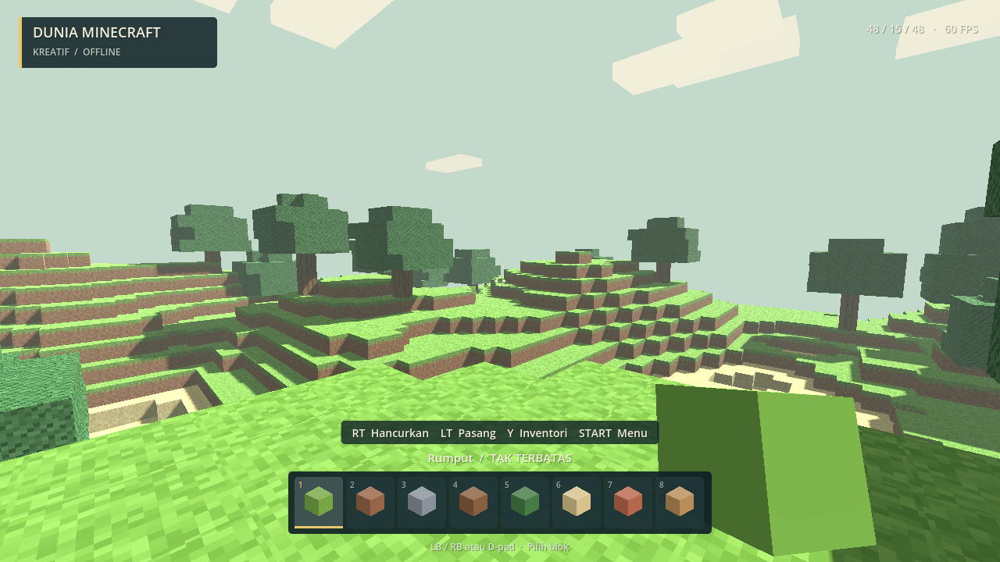

# Dunia Minecraft

Prototipe game voxel 3D **single-player offline** untuk Windows 10/11, dengan kontrol utama **Xbox 360** dan dukungan keyboard/mouse. Dibuat menggunakan Godot 4.6.1 dan renderer Compatibility.



## Mainkan

1. Unduh `DuniaMinecraft-Windows-x64.zip` dari [Releases](https://github.com/Muhira007/Dunia-Minecraft/releases).
2. Ekstrak ZIP, lalu buka `DuniaMinecraft.exe`. Tidak perlu memasang Godot atau menjalankan server.
3. Pilih **Masuk ke dunia** dengan mouse atau tombol **A** pada controller.

Pada folder pengembangan yang sudah dibangun, buka `Mainkan.cmd` atau `build/DuniaMinecraft.exe`.

## Fitur versi 0.1.0

- Dunia berbukit 96 × 96 blok, tinggi maksimum 40 blok, dengan pohon dan area berpasir.
- Kamera orang pertama; berjalan, berlari, melompat, dan jongkok.
- Menghancurkan dan memasang blok hingga jarak 6 blok, dengan penanda sasaran.
- Delapan jenis blok kreatif tak terbatas: rumput, tanah, batu, kayu, daun, pasir, bata, papan.
- Inventori, menu jeda, pengaturan sensitivitas kamera, kembali ke titik awal, dan layar penuh.
- Save otomatis setiap 30 detik bermain, saat kehilangan fokus, dan saat keluar secara normal.
- Cadangan save sebelumnya, pemulihan jika save utama rusak, dan pesan jika penyimpanan gagal.
- Suara interaksi, getaran controller jika didukung, serta jeda otomatis ketika controller terlepas.
- Tekstur piksel dan suara dibuat lewat kode, tanpa aset Minecraft.

Ini masih prototipe kreatif: belum ada survival, crafting, mob, multiplayer, pemilihan banyak dunia, atau dunia tak terbatas. Tidak membutuhkan server maupun koneksi internet untuk bermain.

## Kontrol

| Aksi | Xbox 360 | Keyboard / mouse |
| --- | --- | --- |
| Bergerak | Analog kiri | WASD |
| Melihat | Analog kanan | Mouse |
| Lompat | A | Space |
| Jongkok (tahan) | B | Ctrl |
| Lari (tahan) | Klik analog kiri | Shift |
| Hancurkan blok | RT | Klik kiri |
| Pasang blok | LT | Klik kanan |
| Pilih blok | LB/RB atau D-pad | 1–8 atau scroll |
| Inventori | Y | E |
| Menu jeda | Start | Esc |
| Simpan | Back | F5 |
| Navigasi menu | D-pad / analog kiri; A pilih; B kembali | Panah / Tab / Enter / mouse |
| Layar penuh | — | F11 |

Sensitivitas kamera dapat diubah melalui menu jeda. Analog memakai deadzone agar drift kecil tidak menggerakkan kamera. Tombol B menurunkan badan saat bermain dan kembali saat berada di menu.

Controller harus dikenali Windows. Untuk Xbox 360 wireless diperlukan receiver yang sesuai. Validasi pemetaan dan navigasi menu memakai input sintetis; rasa analog, trigger, getaran, dan koneksi perangkat fisik perlu dicoba pada controller pengguna.

## Penyimpanan

Save: `%APPDATA%\DuniaMinecraft\world.json`. Cadangan: `world.json.bak`. Simpan salinan file ini untuk memindahkan dunia ke komputer lain. Save menyimpan seed, perubahan blok, posisi, arah kamera, dan blok pilihan. Sensitivitas kamera berlaku selama sesi berjalan.

Jika save utama rusak, game mencoba cadangan. Save rusak diarsipkan dengan akhiran `.corrupt-...` sebelum diganti. Jika kedua save tidak dapat dibaca, game membuka dunia awal dan menampilkan pemberitahuan. Uji otomatis memakai file sementara terpisah dan tidak menulis save permainan.

## Pengembangan dan build Windows

Buka `project.godot` dengan **Godot 4.6.1 Standard**. Tidak memerlukan .NET maupun plugin tambahan. Untuk bootstrap, test, export, dan paket ZIP dari PowerShell:

```powershell
powershell -ExecutionPolicy Bypass -File .\tools\build.ps1
```

Script mengunduh Godot portabel (~80 MB) dan export templates resmi (~1,25 GB, hanya pertama kali), memverifikasi SHA-512, menjalankan tes, lalu menghasilkan `build/DuniaMinecraft.exe` dengan PCK tertanam dan ZIP distribusi. Alat tersimpan di `.tools/`; tidak ada instalasi sistem. Setelah alat tersedia, tambahkan `-SkipSetup` untuk membangun tanpa unduhan.

Pengujian langsung:

```powershell
& .\.tools\godot\Godot_v4.6.1-stable_win64_console.exe --headless --path . --script tests/test_core.gd
& .\.tools\godot\Godot_v4.6.1-stable_win64_console.exe --headless --path . -- --smoke-test
& .\.tools\godot\Godot_v4.6.1-stable_win64_console.exe --path . -- --capture
```

Tes inti memeriksa 44 kondisi: determinisme, batas dunia, bedrock, raycast enam arah, rebuild chunk tetangga, mesh/collision, save/backup/pemulihan, data rusak, error tulis, dan input controller. Smoke test memeriksa gerak dan tabrakan pemain, lompat, jongkok, penghancuran/pemasangan, larangan menimpa pemain, analog kamera, serta navigasi inventori/jeda lewat input controller sintetis. Perintah `--capture` menghasilkan tiga PNG di `artifacts/` untuk memeriksa tampilan secara visual.

Uji tampilan awal pada Intel UHD Graphics 620, 1280 × 720: 60 FPS setelah pemuatan. Ini pengukuran pada satu adegan, bukan jaminan performa di semua perangkat atau dunia yang telah banyak diubah. Diperlukan Windows 64-bit dan driver yang mendukung OpenGL 3.3.

## Struktur

- `scripts/voxel_world.gd`: generator deterministik, data voxel, raycast grid, mesh permukaan terbuka, dan collision per chunk 16 × 16.
- `scripts/player.gd`: gerak orang pertama, analog, gravitasi, lompat, dan jongkok.
- `scripts/main.gd`: alur permainan, antarmuka, interaksi, audio, dan integrasi save.
- `scripts/hud.gd`, `blocks.gd`, `game_input.gd`, `save_store.gd`: HUD, tekstur, pemetaan input, dan penyimpanan.
- `tests/test_core.gd`, `tools/build.ps1`: validasi dan build yang dapat diulang.

Godot menggunakan lisensi MIT; lihat `LICENSE-Godot.txt` dan `THIRD-PARTY-Godot.txt`. Referensi: [dokumentasi controller](https://docs.godotengine.org/en/stable/tutorials/inputs/controllers_gamepads_joysticks.html), [export Windows](https://docs.godotengine.org/en/4.6/tutorials/export/exporting_for_windows.html).

Proyek independen; tidak berafiliasi dengan atau didukung Mojang/Microsoft. Minecraft adalah merek pemiliknya masing-masing.
