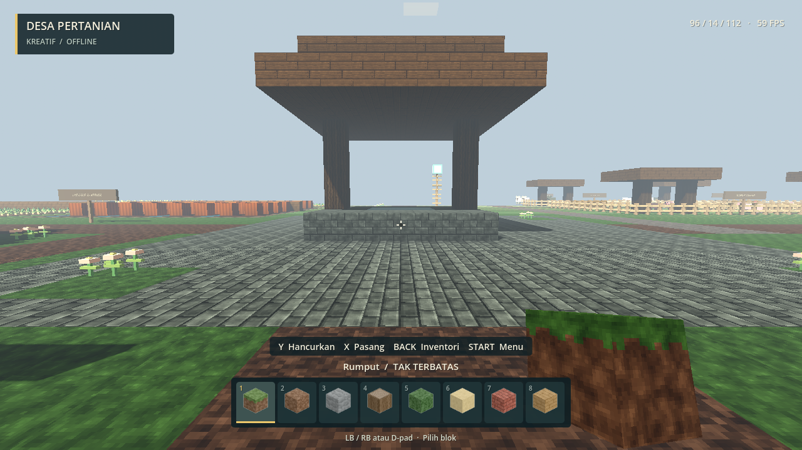
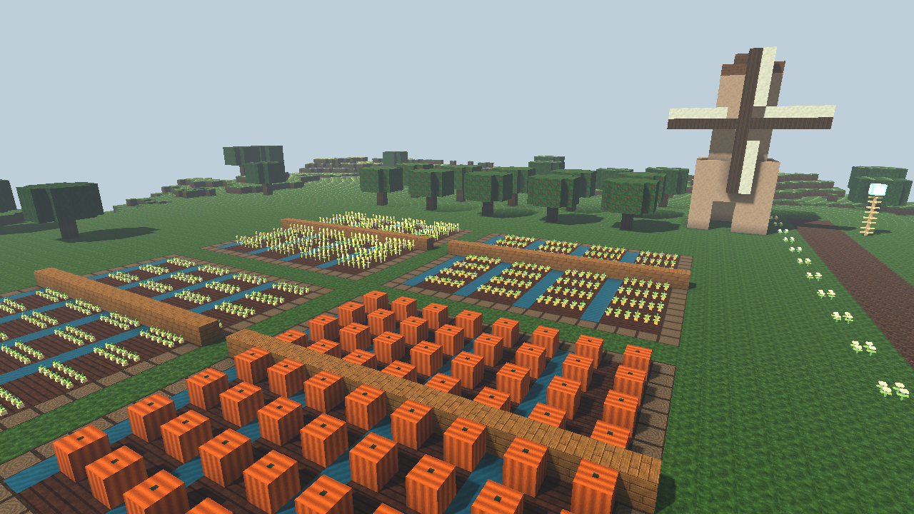

# Desa Pertanian · v0.3

Jalankan **Mainkan.bat**, pilih **Desa Pertanian**, lalu tunggu indikator pemuatan selesai. Anda mulai di jalan dekat sumur desa. Dunia dibuat satu kali secara deterministik; perubahan Anda disimpan terpisah dari Dunia Klasik. Memilihnya lagi melanjutkan dunia, bukan meresetnya.

## Tempat yang bisa dikunjungi

Koordinat X/Z terlihat di HUD (angka pertama/ketiga). Posisi Y adalah ketinggian.

| Kawasan | Perkiraan X / Z | Yang tersedia |
| --- | --- | --- |
| Alun-alun | 96 / 98 | Sumur, bunga, jalan utama |
| Permukiman | 75–135 / 110–149 | Enam rumah kayu/batu dengan pintu terbuka dan perabot blok sederhana |
| Pasar kecil | 90–106 / 118 | Dua kios beratap kain warna |
| Ladang | 49–84 / 54–89 | Gandum, wortel, kentang, labu, irigasi dan titian |
| Kebun apel | 47–79 / 36–44 | Sepuluh pohon berbuah dekoratif |
| Kincir | 88 / 37 | Menara dan empat baling-baling dekoratif dari blok |
| Lumbung | 127 / 38 | Bangunan merah dengan bal jerami dan pintu besar terbuka |
| Peternakan | 116–149 / 54–87 | Empat kandang, tempat berteduh, jerami dan air |
| Gudang kecil | 149 / 108 | Bangunan kayu beratap deepslate |
| Kolam & jembatan | 117 / 155 | Kolam dangkal dan jembatan kayu berpagar |
| Padang membangun | 35–65 / 108–166 | Bagian area kosong untuk bangunan Anda; ruang lain juga terbuka di pinggir desa |

## Ternak

5 sapi, 5 domba, 4 babi, dan 6 ayam tersedia sejak awal. Mereka memiliki bentuk/warna berbeda, animasi kaki sederhana, collision, serta pilihan berjalan atau diam. Gerak aktif dalam jarak sekitar 48 blok; tampilan hewan dibatasi sekitar 76 blok. Pause, inventori, dan menu dunia menghentikan AI.

Hewan tetap dibatasi wilayah kandang asal meskipun pagarnya dibongkar. Mereka mencoba menghindari blok dan tepian; jika tanah tempatnya berdiri tidak aman, mereka mencari posisi aman lain di kandang. Jika seluruh kandang dibuat tidak layak, hewan disembunyikan sementara dan mencoba muncul lagi setelah ada tempat aman. Posisi/arah tersimpan, tetapi waktu animasi dan keputusan berjalan dimulai kembali saat dunia dimuat.

Tidak ada menambah jumlah hewan, membunuh, memberi makan, breeding, memerah susu, mengambil telur, wol, atau menunggang pada versi ini. Jangan menganggap hewan atau kios sudah menjalankan sistem ekonomi/peternakan lengkap.

## Bahan baru dan batas pertanian

187 bahan kini tersedia lewat **Back/E**: tambahan berupa tanah ladang, air kolam, bal jerami, labu, daun apel, tiga tanaman, pagar, dan bunga. Tanaman serta bangunan bisa dibongkar dan ditempatkan kembali dengan kontrol kreatif biasa (**Y hancurkan / X pasang**). Belum ada panen yang menghasilkan item atau pertumbuhan otomatis.

Air adalah material dekoratif transparan tanpa aliran, daya apung, atau mekanik berenang. Kolam/irigasi bawaan dangkal. Pagar tampak sebagai tiang/rel tetapi collision masih mencakup sel kubus agar ternak tidak menembus celah. Kincir dan kios dekoratif, tidak bergerak/berdagang. Ranting, pohon, pagar, dan jalan adalah bagian dunia yang bisa diedit; papan petunjuk dan hewan adalah objek terpisah.

## Save dan performa

Save desa: `%APPDATA%\voxelstride\worlds\desa-pertanian.json`. Cadangan terakhir: `.json.bak`. Dunia Klasik tetap di `world.json`; salinan awalnya dilindungi oleh `world.json.pre-v0.3.bak` saat pertama kali dibuka di versi ini.

Pergantian dunia melalui **Start/Esc → Simpan & pilih dunia** menyimpan dunia yang ditinggalkan terlebih dahulu. Jika gagal, game tidak mengganti dunia. Save rusak yang tidak dapat dipulihkan tidak direset otomatis.

Dunia berukuran 192 × 192 × 40 dengan chunk 16 × 16. Sekitar 7 × 7 chunk dekat pemain diminta, dengan satu lapisan tambahan dipertahankan sementara untuk mengurangi bongkar/pasang berulang (maksimum sekitar 81 chunk). Pemuatan mesh dilakukan bertahap; menjelajah cepat atau mengedit area padat dapat menyebabkan jeda singkat. Di posisi tinggi, batas area render dapat terlihat. Ini bukan dunia tak terbatas.

Pengukuran awal sekitar 59–60 FPS dilakukan pada Intel UHD Graphics 620, 1280 × 720 setelah pemuatan. Rasa kontrol perangkat Xbox fisik dan performa sesi panjang di dunia yang banyak dimodifikasi tetap perlu diuji pengguna. Jika ada bug, jalankan **Debug.bat** dan kirim log terkait dari `artifacts/logs/` beserta langkah mengulang masalahnya.
