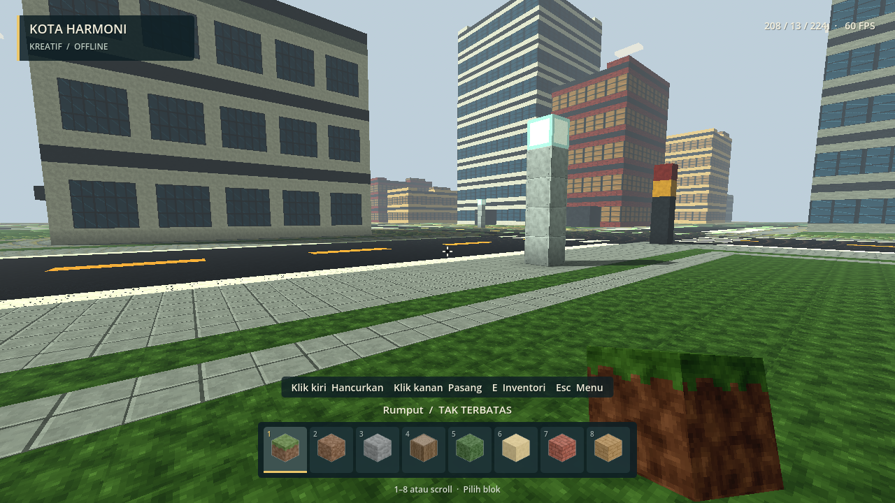
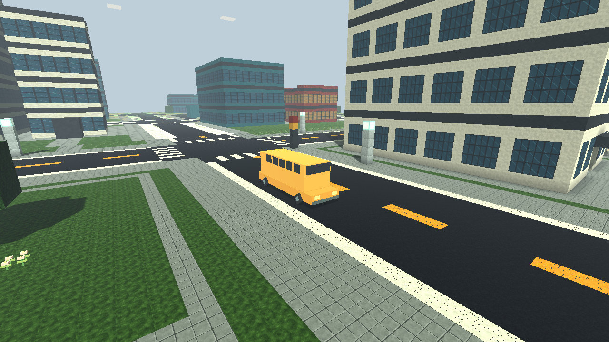
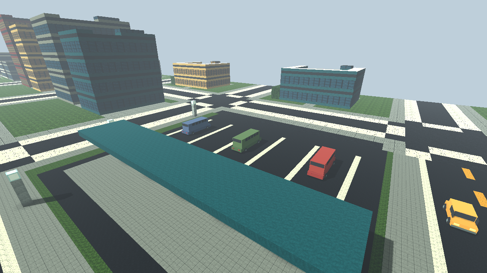

# Kota Harmoni · v0.5

Klik **Mainkan.bat**, pilih kartu **Kota Harmoni** di katalog, lalu **Buka dunia**. Pada controller, arahkan pilihan ke kartu dan tekan **A**. Ukuran dunia **384 × 384 × 80**, sama luasnya dengan Lembah & Air Terjun. Slot kota baru tidak mengganti tiga dunia sebelumnya.

## Jelajah kota

Mulai di tepi Taman Harmoni pada **X 208 / Z 224**, tinggi tanah Y 12. Lima jalan utara–selatan dan lima jalan timur–barat membentuk jaringan boulevard di koordinat **48, 120, 192, 264, dan 336**. Utara berarti Z mengecil; timur berarti X membesar. Jalan membentang sampai tepian dunia dan memiliki marka tengah, garis tepi, zebra cross, serta trotoar datar agar mudah dilewati.

| Tujuan | Perkiraan X / Z | Isi |
| --- | --- | --- |
| Taman Harmoni | 228 / 228 | Ruang hijau utama, kolam hias, bangku, bunga dan pepohonan. |
| Menara Cakrawala | 146 / 164 | Gedung tertinggi, sembilan lantai; pintu di sisi selatan dan tangga zig-zag sampai atap. |
| Galeri Kota | 213 / 162 | Gedung tujuh lantai dengan fasad biru, di seberang distrik bisnis. |
| Pasar Boulevard | 81 / 233 | Deretan gedung pertokoan dengan kanopi warna. |
| Terminal Utara | 300 / 79 | Tiga bus parkir, jalur parkir, atap peron dan bangku tunggu. |
| Apartemen Timur | 285 / 232 | Hunian bertingkat di sebelah timur taman utama. |
| Balai Kota | 151 / 305 | Gedung tiga lantai dengan halaman terbuka. |
| Depot Logistik | 287 / 305 | Gudang rendah dan van niaga parkir. |
| Taman Barat Daya | 84 / 300 | Ruang hijau kedua dengan kolam hias. |
| Hunian tepi kota | X 12 / 350, atau Z 12 / 350 | Gedung rendah di luar jaringan jalan utama. |

Ada **40 gedung**, dari dua lantai di pinggiran sampai sembilan lantai di pusat. Semua punya pintu terbuka di sisi selatan dan tangga blok ke atap. Gunakan **A / Space** untuk menaiki anak tangga satu blok. Interior masih sederhana: lantai, tangga dan beberapa perabot lobby; bukan simulasi kantor/apartemen berpenghuni. Nama balai kota, pasar, dan galeri menandai tema bangunan, bukan layanan interaktif.

## Kendaraan

Tersedia **22 kendaraan: 12 mobil, 5 bus, dan 5 van**. Sepuluh bergerak pada dua rute persegi di boulevard luar dan boulevard dalam; dua belas lainnya parkir di terminal, depot, dan halaman gedung.

Kendaraan bergerak sekitar lima blok per detik dengan roda berputar. Mereka mengalah jika pemain/kendaraan lain berada di depan, berhenti saat ada blok yang menghalangi, dan tidak meneruskan perjalanan jika jalan di bawahnya dibongkar. Kembalikan jalan atau singkirkan penghalang untuk melanjutkan arus. Kendaraan tidak mencari jalan alternatif. Belokan masih sederhana dengan perubahan arah di simpang, bukan simulasi kemudi realistis.

Kendaraan memiliki collision saat berada di area detail dekat pemain. Anda tidak dapat memasang blok di dalam badan kendaraan. Menu jeda, inventori, dan katalog dunia menghentikan lalu lintas; pemilihan dunia lain membersihkan kendaraan kota. Posisi kendaraan bergerak disimpan sebagai kemajuan pada rute. Kendaraan parkir memiliki posisi tetap dari generator.

**Belum bisa dikendarai**, dinaiki sebagai penumpang, ditambang, dihancurkan, atau dibuat lewat inventori. Belum ada klakson/suara mesin, NPC, damage tabrakan, sistem lalu lintas berbasis lampu, ataupun simulasi kemacetan lengkap. Tiang lampu jalan bercahaya; rambu merah/kuning hanya dekorasi dan tidak mengatur arus.

## Blok kota dan performa

Tujuh bahan baru tersedia di inventori **Back / E → Bangunan**: aspal, paving, marka putih/kuning, panel jendela biru/hangat, dan ventilasi atap. Total sekarang **194 bahan**; semua ID lama tetap sama. Jalan, taman, dan gedung dapat diedit seperti blok biasa (**Y hancurkan / X pasang**). Panel jendela opak dibuat untuk fasad hemat rendering, bukan kaca tembus pandang.

Dunia menggunakan data voxel 384 × 384 × 80; sekitar 7 × 7 chunk detail dimuat dekat pemain dengan satu lapis retensi (maksimum sekitar 81). Pemandangan jauh tetap memperlihatkan bentuk dan pola fasad gedung, tetapi geometri dan teksturnya disederhanakan. Perubahan detail saat mendekat dapat terlihat. Kendaraan jauh disembunyikan dan collision-nya dinonaktifkan; hanya sepuluh rute sederhana yang tetap diperbarui selama bermain.

Pada satu pengujian Intel UHD Graphics 620, 1280 × 720, adegan diam setelah pemuatan menunjukkan 60 FPS; median frame 16,7 ms di taman dan 16,8 ms di boulevard, p95 18,6/18,8 ms (180 frame per adegan). Pemuatan sesi itu 14,1 detik. Angka ini bukan jaminan 60 FPS saat berlari, mengedit kota, atau pada perangkat lain. Pembuatan mesh chunk masih bisa menyebabkan jeda singkat.

## Save

Save kota: `%APPDATA%\voxelstride\worlds\kota-harmoni.json`, cadangan `.json.bak`. Generator kota memiliki ID 4. Dunia Klasik, Desa Pertanian, dan Lembah & Air Terjun tetap menggunakan file dan generator masing-masing. Memilih kartu template lagi **melanjutkan slot**, tidak meresetnya.

Jika save utama rusak, game mencoba cadangan kota. Jika tidak ada save valid, pemuatan dibatalkan dan pesannya tampil pada halaman katalog. Kegagalan menyimpan dunia yang sedang dimainkan juga membatalkan perpindahan. Tes otomatis memakai folder sementara sendiri, bukan save pemain.

Laporkan masalah melalui **Debug.bat** dan sertakan log dari `artifacts/logs/`, nama dunia, koordinat, dan langkah pemicu. Kontrol perangkat Xbox fisik dan sesi panjang masih perlu diuji pengguna.
