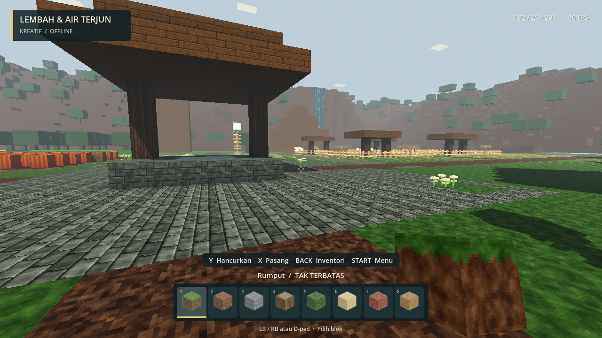
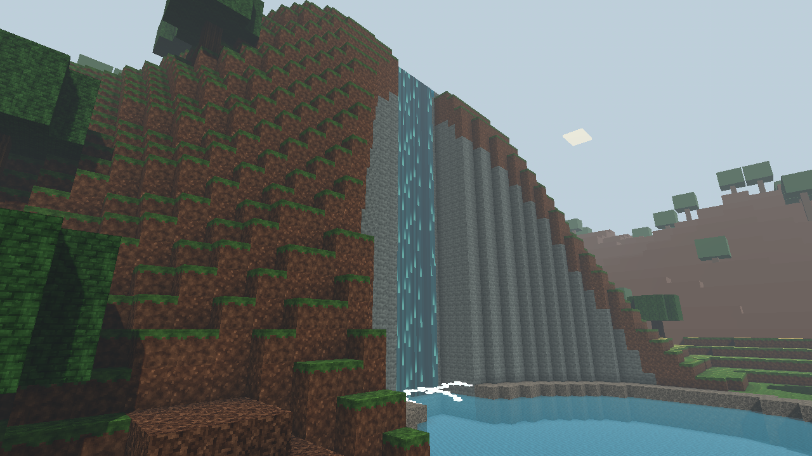
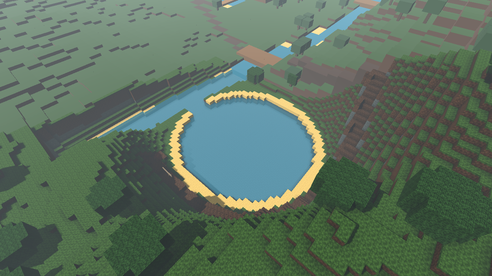
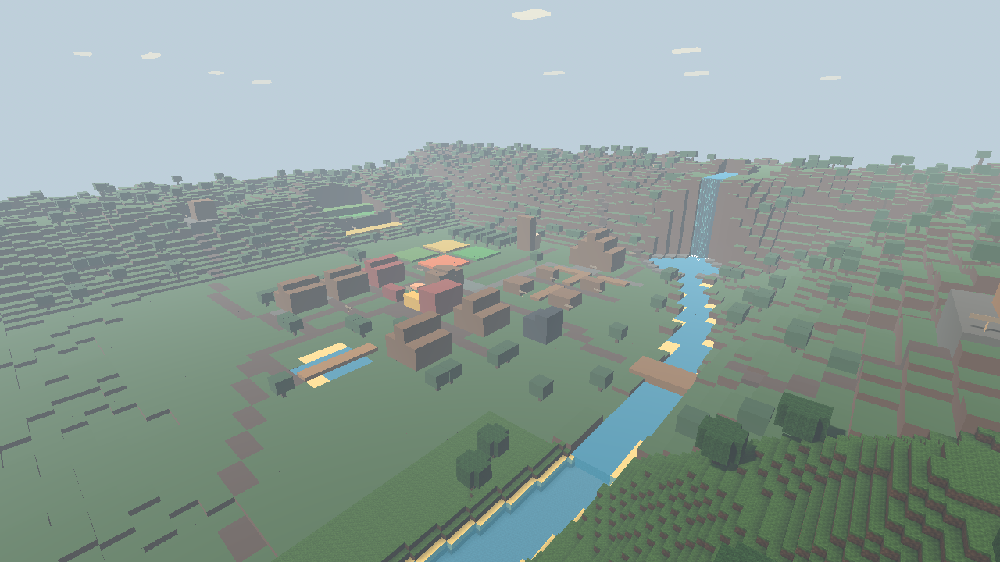

# Lembah & Air Terjun · v0.4

Tutup game lama, klik **Mainkan.bat**, lalu pilih **Lembah & Air Terjun**. Ini slot ketiga yang terpisah, bukan pembesaran save Desa Pertanian. Ukurannya **384 × 384 × 80**: sisi dua kali panjang desa, luas empat kali, dan batas tinggi dua kali. Dunia Klasik dan Desa Pertanian tetap dapat dilanjutkan seperti biasa.

## Rute jelajah

Anda mulai dekat sumur desa pada X 192 / Z 208. Koordinat di kanan atas adalah **X / Y / Z**. Utara berarti Z mengecil, timur berarti X membesar. Ikuti jalan tanah; tanjakan satu blok perlu dilompati dengan **A / Space**. Tahan klik analog kiri / Shift untuk berlari. **Start/Esc → Kembali ke titik awal** dapat digunakan jika tersesat.

| Tujuan | X / Z | Petunjuk |
| --- | --- | --- |
| Desa lembah | 192 / 208 | Enam rumah, sumur, pasar kecil, ladang, kebun apel, lumbung, dan 20 ternak. |
| Peternakan | 212–245 / 150–183 | Empat kandang dengan sapi, domba, babi dan ayam. |
| Air terjun utara | 230 / 108 | Ambil jalan ke timur sumur, ke utara melalui sela kandang, lalu belok mengitari timur lumbung. Kolam berada di depan tebing. |
| Jalur puncak | 216 / 62 | Percabangan di utara kandang menuju barat laut, lalu mendaki ke sumber air. |
| Kebun bertingkat | 101 / 173 | Jalan barat desa menuju teras gandum, wortel, dan kentang; ketinggian tanah 23, 27 dan 31. |
| Pondok hutan | 80 / 242 | Keluar lewat barat daya permukiman. Pintu pondok berada di sisi selatan. |
| Menara pandang | 325 / 222 | Keluar ke timur, lewati jembatan utara pada Z 204, ikuti jalan naik. Tangga berada di selatan menara. |
| Danau selatan | 290 / 349 | Ikuti jalan selatan, lintasi jembatan pada Z 292, kemudian mengitari tepi timur danau. |
| Padang terbuka | 155–230 / 290–340 | Lahan terbuka di selatan desa, sebelum perbukitan tepi dunia, untuk membangun. |

Papan nama menandai tujuan. Jalan, pepohonan, jembatan, dan bangunan merupakan blok yang bisa diedit. Perluasan tidak memindahkan bangunan buatan Anda dari dunia sebelumnya; masing-masing tetap berada dalam save asalnya.

## Air dan ternak: batas mekanik

Air terjun memiliki tirai animasi setinggi 35 blok, percikan ringan, serta suara gemuruh sintetis yang melemah dengan jarak dan berhenti diproses di luar jangkauan audio. Pause, inventori, dan pemilihan dunia menghentikan animasi dan suara. Efek ini objek dekoratif tetap, bukan blok cair yang bersimulasi: membongkar sumber atau tebing **tidak mengubah aliran efek**, dan tirainya tidak bisa ditambang atau dipindahkan.

Sungai, kolam, irigasi, dan danau memakai blok air transparan yang dapat dipasang/dihapus. Alur bawaan bersambung tetapi tidak menjalankan simulasi aliran, berenang, daya apung, atau banjir. Air sungai/danau bawaan sedalam dua blok; pemain berjalan di dasar, bukan berenang. Tidak ada damage jatuh atau tenggelam pada prototipe kreatif ini.

20 hewan tetap dibatasi kandang masing-masing; tidak ditambah menjadi 80 agar beban AI terkendali. Mekanik hewan dan tanaman sama dengan [Desa Pertanian](DESA-PERTANIAN.md): belum ada feeding, breeding, pertumbuhan atau hasil panen. Pondok, menara, dan kincir bukan sistem NPC/ekonomi.

## Pemuatan dan pemandangan jauh

Data blok seluruh dunia tersimpan dalam satu array sekitar **11,25 MiB**, di luar mesh, tekstur, audio, dan memori engine. Generator membentuk medan bertahap dengan indikator kemajuan, kemudian menata fitur, membuat pemandangan jauh, dan menyiapkan area pemain. Tahap penataan desa masih dapat berhenti sejenak karena sebagian kerja generator berjalan di thread utama.

Detail bertekstur dan collision hanya diminta di sekitar pemain, sekitar 7 × 7 chunk berukuran 16 × 16; satu lapis tambahan ditahan sementara, maksimum sekitar 81 chunk. Di luarnya, 576 petak pemandangan jauh menampilkan bentuk medan/bangunan dan pepohonan sederhana. Petak jauh disembunyikan setelah detail siap dan diperbarui ketika chunk yang diedit dilepas.

Gambar ini menggunakan jarak detail permainan biasa, bukan memuat seluruh dunia dalam kualitas penuh. Bentuk jauh lebih kasar, warna tidak persis sama dengan tekstur, dan pergantian tingkat detail dapat terlihat. Pemandangan jauh **tidak memiliki collision**; pemain ditahan jika hendak memasuki chunk yang collision-nya belum siap. Jarak tampilan tidak memperluas batas berjalan: dunia tetap terbatas 384 × 384.

Pembuatan mesh, terutama saat berlari melintasi chunk atau mengedit banyak blok, masih dapat menyebabkan drop FPS/jeda. Pengukuran sesaat sesudah pemuatan bukan jaminan 60 FPS sepanjang sesi atau pada semua perangkat. Jarak detail dan jumlah hewan tidak dinaikkan hanya karena luas dunia bertambah. Uji perangkat Xbox fisik dan sesi panjang tetap perlu dilakukan pengguna.

## Save dan laporan bug

Save: `%APPDATA%\voxelstride\worlds\lembah-air-terjun.json`, dengan backup `.json.bak`. Save mencatat identitas dunia, tinggi 80, generator 3, edit blok, pemain, hotbar, dan hewan. Memilih slot lagi melanjutkan save, bukan membuat ulang kemajuan. Efek air terjun mengulang waktu animasinya ketika dunia dimuat kembali.

Generator Klasik dan Desa Pertanian tidak diubah. Tes otomatis memakai folder sementara sendiri dan tidak membaca/menulis file permainan Anda. Jangan membuka save lembah dengan EXE v0.3 atau lebih lama.

Jika menemukan bug, gunakan **Debug.bat**, lalu kirim log terbaru dari `artifacts/logs/`, nama dunia, koordinat, serta langkah mengulang masalahnya. Waktu `WORLD LOAD` hingga `WORLD READY` dan durasi pemuatan tercatat agar jeda awal dapat dibedakan dari masalah saat bermain.
