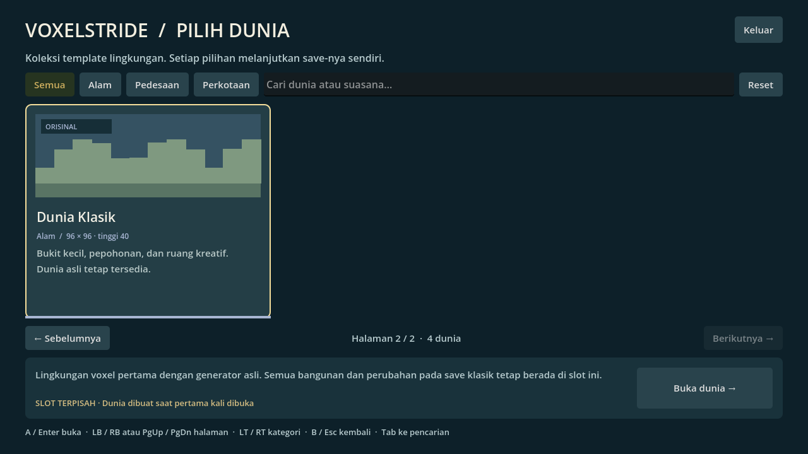

# Katalog template dunia

Halaman katalog menggantikan daftar tombol dunia pada menu awal. Klik **Mainkan.bat** untuk membukanya, atau gunakan **Start/Esc → Simpan & pilih dunia** saat bermain.

Setiap kartu berisi ilustrasi tema (bukan screenshot dunia), nama, kategori, ukuran, tinggi dan ringkasan. Pilih kartu untuk membaca keterangannya, lalu klik **Buka dunia / Lanjutkan**. Memilih kartu saja tidak mulai memuat dunia. Satu template saat ini memiliki satu slot save tetap; ini belum sistem membuat beberapa save dari template yang sama.

- **Halaman:** tiga kartu per halaman. Gunakan Sebelumnya/Berikutnya, **PgUp/PgDn**, atau **LB/RB**. Halaman bertambah otomatis mengikuti jumlah template, tanpa menumpuk tombol di menu utama.
- **Kategori:** Semua, Alam, Pedesaan dan Perkotaan. Klik tab atau gunakan **LT/RT**. Tahan trigger tidak mengganti kategori berkali-kali.
- **Pencarian:** klik kolom atau navigasikan dengan Tab, lalu ketik nama/kata pada ringkasan; tidak peka huruf besar/kecil. Filter kategori dan pencarian dapat digabung.
- **Controller:** D-pad kiri/kanan atau analog memilih kartu; **A** membuka pilihan. D-pad atas mengarah ke kategori dan kemudian tombol Keluar; bawah menuju kartu/tombol buka. **B/Start** kembali bermain bila ada dunia aktif.
- **Keyboard:** panah memilih, Enter membuka, Tab berpindah kontrol, Esc kembali bermain. Tombol Keluar digunakan untuk keluar dari katalog awal.
- **Reset:** membersihkan pencarian dan kategori. Jika tidak ada hasil, tombol buka dinonaktifkan; tidak ada dunia tersembunyi yang terbuka dari pilihan lama.

Status **Save tersedia** didasarkan pada keberadaan file utama/cadangan, bukan jaminan file valid. Validasi penuh dilakukan ketika dunia dibuka. Tidak ada reset, penghapusan atau migrasi save saat hanya menavigasi katalog. Dunia yang sedang dimainkan dapat dilanjutkan tanpa pemuatan ulang.

## Menambahkan template berikutnya (pengembang)

Metadata terpusat di `scripts/world_catalog.gd`: ID stabil, nama, kategori, ukuran/tinggi, versi generator, path save tetap, keterangan, warna dan ilustrasi kartu. Renderer katalog dan validasi save mengambil metadata dari sumber ini.

1. Tambahkan entri dan ID yang unik pada `ENTRIES` / `WORLD_IDS`. Jangan mengganti ID, ukuran, generator atau path template yang sudah dirilis karena perubahan indeks dapat merusak kecocokan save.
2. Implementasikan generator dan spawn baru di `voxel_world.gd`, lalu kaitkan pemuatan/objek khususnya di `main.gd`. Katalog bukan import otomatis map dari internet; generator tetap kode proyek.
3. Tambahkan kategori baru bila perlu dan sesuaikan presentasinya. Ilustrasi dapat memakai variasi `world_card.gd`; tidak wajib menambah gambar raster.
4. Tambahkan tes generator, collision, save terpisah, pergantian dunia, serta batas performa. Uji pencarian dan halaman terakhir. Tes sekarang juga memakai katalog sintetis 17 entri untuk memeriksa penambahan halaman.

Urutan kartu boleh diubah tanpa mengubah identitas save. Empat template saat ini: kota, lembah, desa, lalu klasik. Tiga dunia lama tetap tersedia; Dunia Klasik ada di halaman kedua atau kategori Alam.
